# Solución a errores de NAT
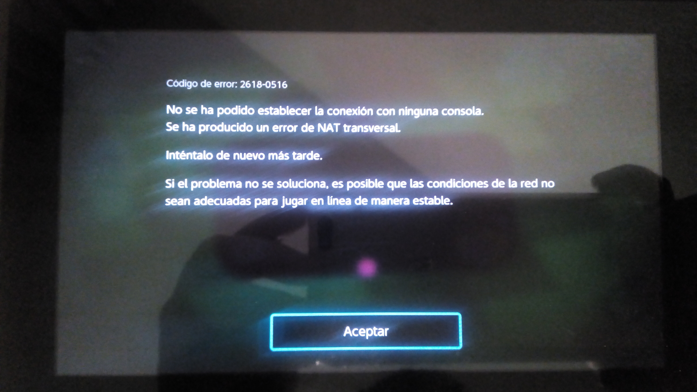

No me diga, conecto su consola a internet, quiso acceder al multijugador en linea y le apareció un mensaje de error:

```
Código de Error: 2618-0516
No se ha podido establecer la conexión con ninguna consola
Se ha producido un error de NAT Transversal

Intentelo de nuevo mas tarde

Si el problema no se soluciona, es posible que las condiciones de la red no sean adecuadas para jugar en linea de manera estable
```

Algo relacionado con la NAT, hizo una prueba de conexión y..

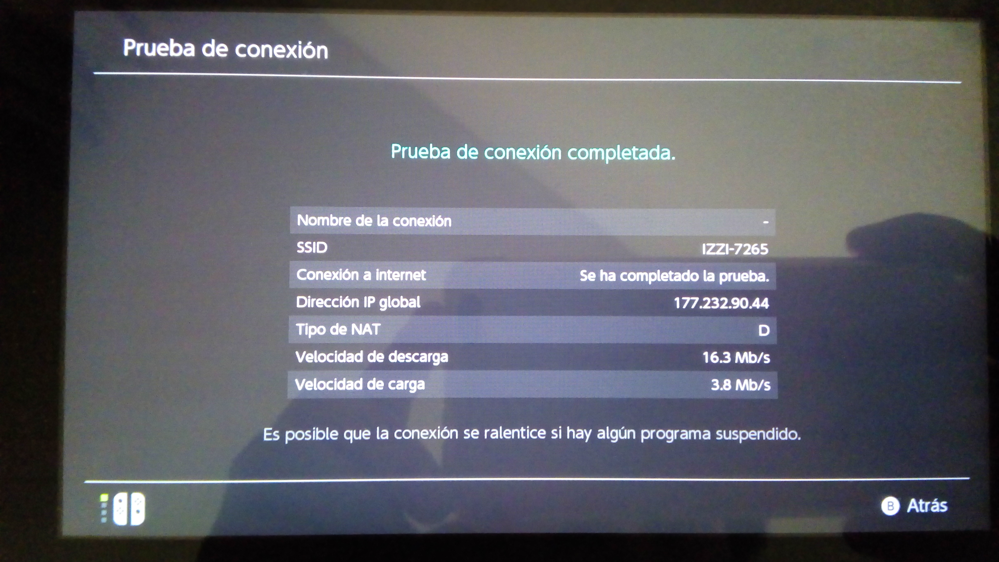

Esto de la NAT D se debe a la forma en que los proveedores de internet (En mi caso IZZI telecom) comparten una misma IP externa entre todo un sector de su área de cobertura, hay varias razones técnicas y económicas validas por las que se hace eso (no es nada mas por molestar) pero no quita que NAT D no basta para acceder al servicio en linea de la mayoría de los juegos (Aunque Tetris 99 SI funciona con NAT D por si se lo pregunta).

Tanto Nintendo, Sony, IZZI y demás suelen ofrecer una serie de pasos para corregir esto abriendo puertos en el módem y usando la DMZ del cortafuegos pero no hay garantía de éxito, en ese caso ¿Esta todo perdido?, ¿Se quedara sin jugar?, ¿Tendrá que pagar por una IP estática? no tema, hay otra solución.

Lo que podemos hacer es conectarnos a internet con un VPN, compartir esa conexión y conectar la consola a la conexión compartida, hecho esto nos saltaremos la configuración del NAT de nuestro proveedor y podremos elegir por el servidor del VPN con mejor NAT, ¿Suena complicado?, no se preocupe vayamos paso por paso.

## VPN
Ahorrándonos lo técnico, un VPN (Virtual Private Network) es una conexión que nos permite acceder a internet desde una red en otra ubicación, saltándonos restricciones de IP, cortafuegos, restricciones de ubicación y configuraciones raras del NAT, esto ultimo es lo que nos interesa.

## ProtonVPN
Para este ejemplo usaremos el servicio de ProtonVPN, los pasos funcionan con cualquier VPN de su preferencia pero yo le sugiero ProtonVPN por que tienen un plan gratuito con el cual puede probar que todo funcione y ya luego pasarse a uno de sus planes de paga.

Solamente vaya a la pagina https://protonvpn.com/ cree una cuenta en el plan gratuito y descargue la aplicación, ya instalada e iniciada la sesión lucirá así.

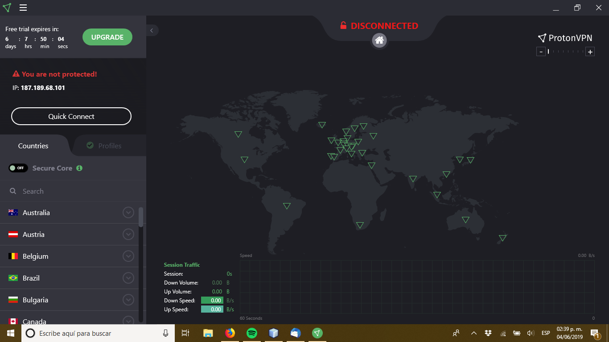

Ahora conéctese a alguno de los servidores del VPN (si es para conectarse a un juego le recomiendo seleccione un servidor en los USA) y desde ese momento todas las conexiones y paginas web actuaran como si se conectara desde ese lugar.

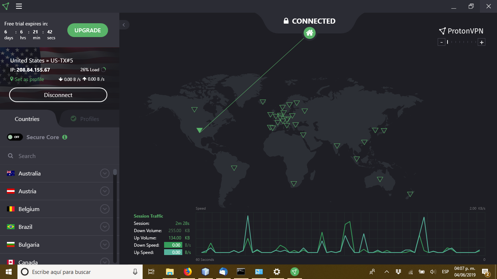

Ahora vaya al Centro de redes y recursos compartidos, Conexiones de red y notara que una nueva conexión apareció (En este caso es Ethernet 3) y que le aparece la descripción TAP-ProtonVPN Windows Adaptar V9, esa es la conexión del VPN, recuerde eso, lo usaremos mas adelante.

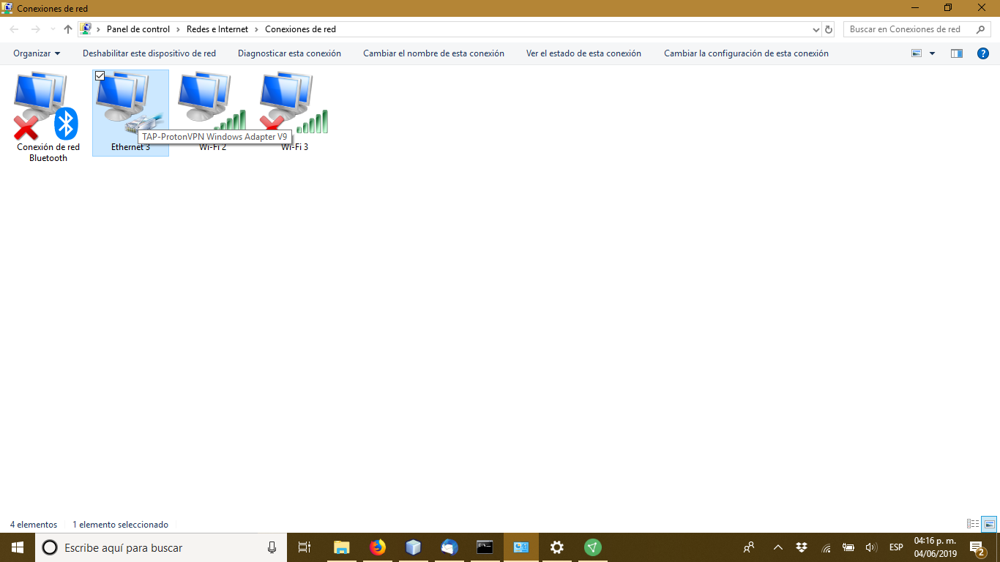

## Compartir la conexión a internet
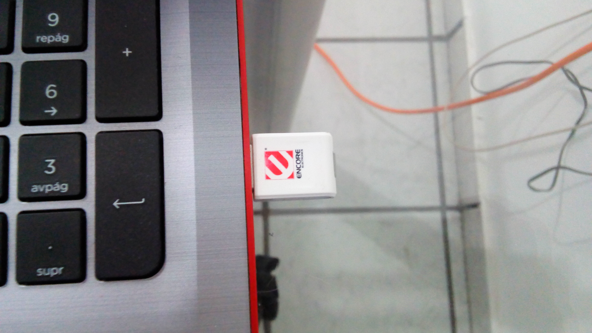

Ahora necesitamos compartir la conexión de internet de la computadora donde nos conectamos al VPN, esto tal vez implique conseguir algo de hardware extra ya sea un adaptador WiFi USB o una tarjeta de red inalámbrica adicional, lo que tenga a la mano o le sea mas económico, aunque hay una consideración critica, *ese hardware adicional debe poder usarse como un hotspot inalámbrico*, ¿Como sabemos eso? conecte el hardware, abra un cmd como administrador.

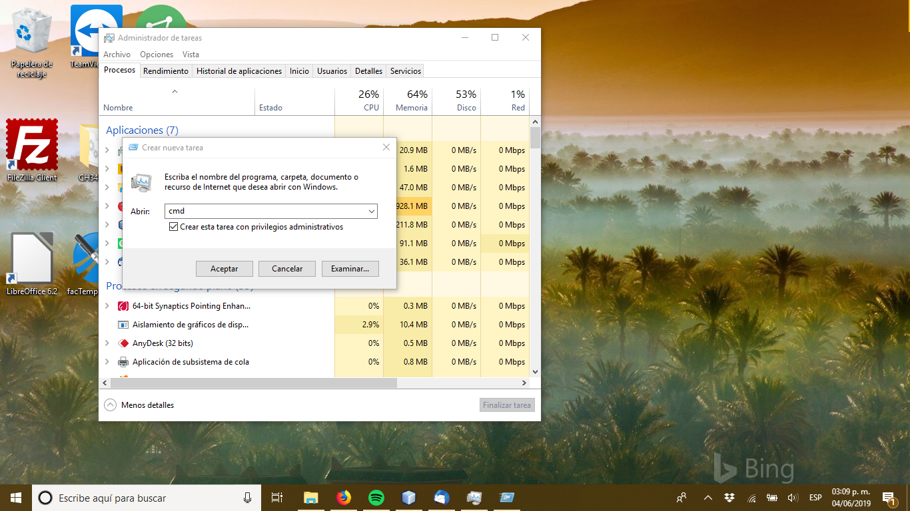

y ejecute el comando

```
NETSH WLAN SHOW DRIVERS
```

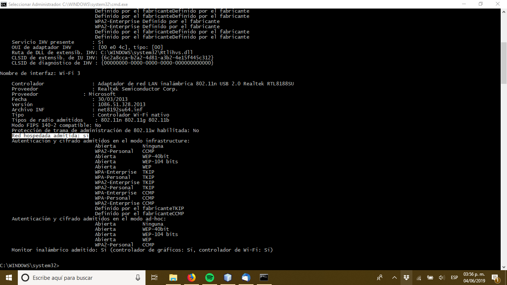

Este le listara las propiedades de las tarjetas inalámbricas en su sistema, en la salida del comando busque la tarjeta inalámbrica nueva o el adaptador USB WiFI (en este ejemplo es Wi-Fi 3, pero eso variara en su sistema) y vea que diga *Hosted network supported: Yes* o *Red hospedada admitida: sí* de lo contrario necesitara un adaptador o tarjeta que puedan usarse de hotspot.

Hecho esto vaya a la configuración de Windows (El engrane que aparece en el menú de inicio), Red e Internet, Zona con cobertura inalámbrica móvil y actívelo.

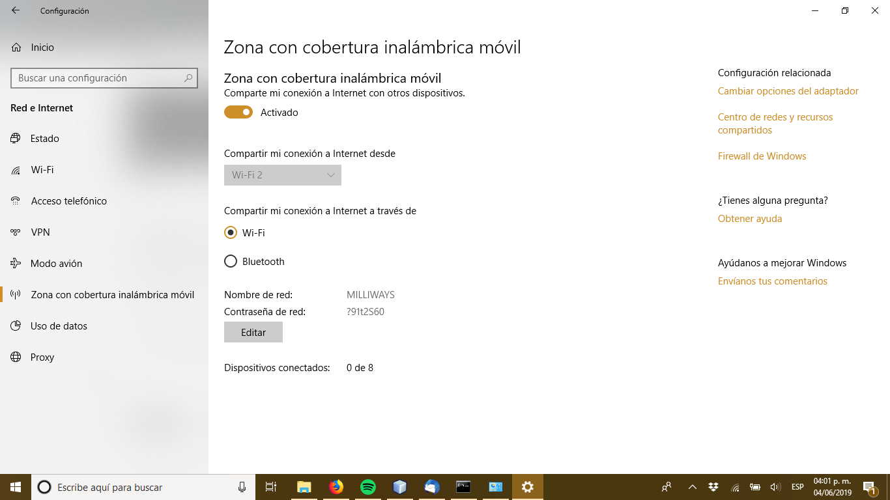

Hecho esto vaya al centro de redes y recursos compartidos y notara que una nueva conexión apareció, esta representa nuestra red hotspot, recuerde el nombre de esa red, lo ocuparemos en unos momentos.

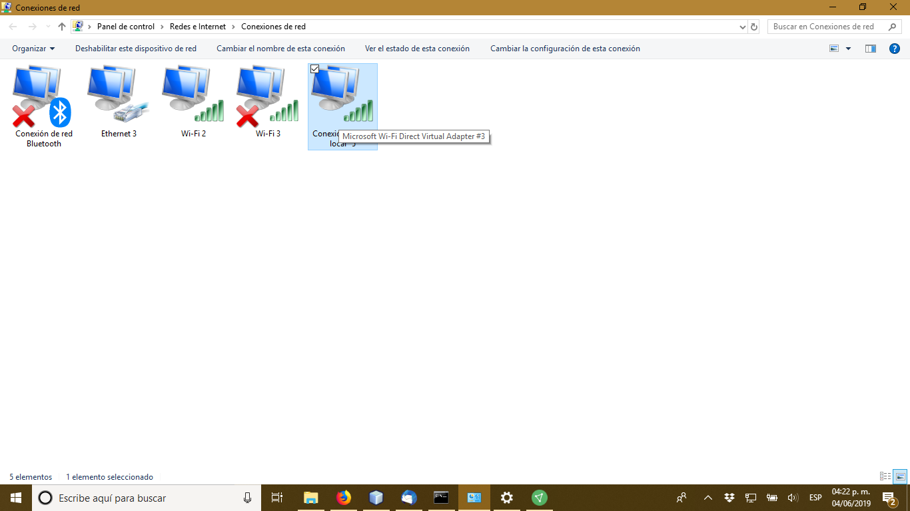

## Compartir el VPN vía el Hotspot

Para hacer esto de clic con el botón derecho sobre la conexión del VPN (Ethernet 3 en este ejemplo) y vaya a Propiedades, *Uso compartido*.

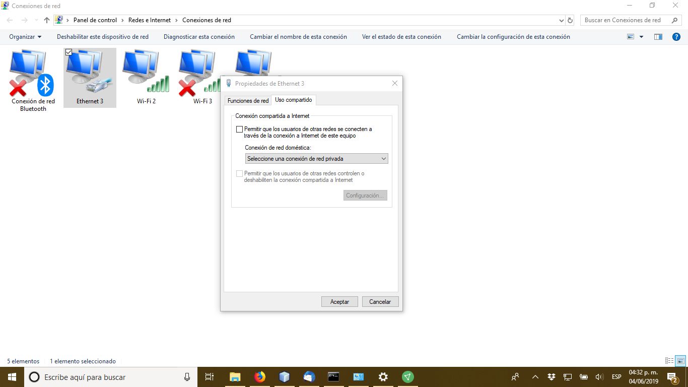

Habilite el *Permitir que los usuarios de otras redes se conecten a través de la conexión a internet de este equipo* y seleccione la red del hotspot (en este ejemplo conexión de área local* 5)

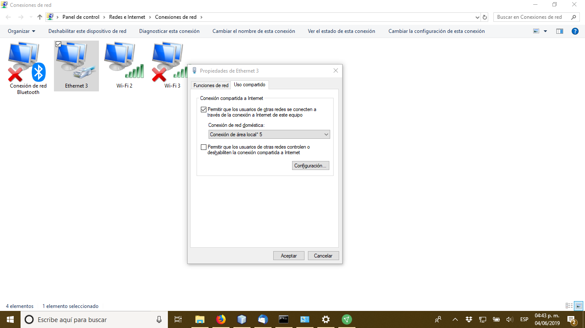

De aceptar y el sistema hará las configuraciones necesarias

Vaya de vuelta a *Configuración de Windows, Red e Internet, Zona con cobertura inalámbrica móvil* y ahí vera el nombre de la red hotspot y la contraseña.


Y listo, ya su hotspot esta compartiendo su conexión a VPN, ahora volvamos a lo que nos interesa.

## Usando la conexión VPN desde su consola.

Ahora a lo que veníamos, vaya a la configuración de su consola (Un Nintendo Switch en este caso) y conectese no a la red inalámbrica usual, sino al hotspot el nombre de la red y contraseña los vio en el paso anterior.

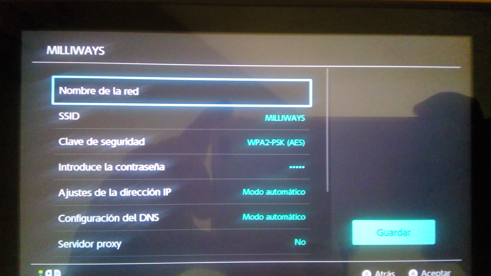

Hagamos la prueba de red…

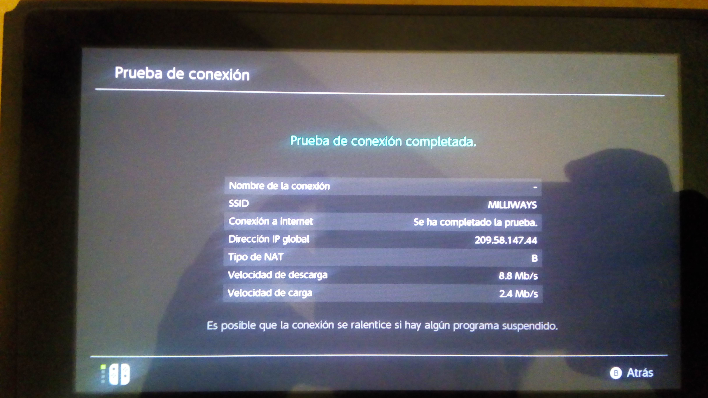

Ahora vamos a la partida on-line.

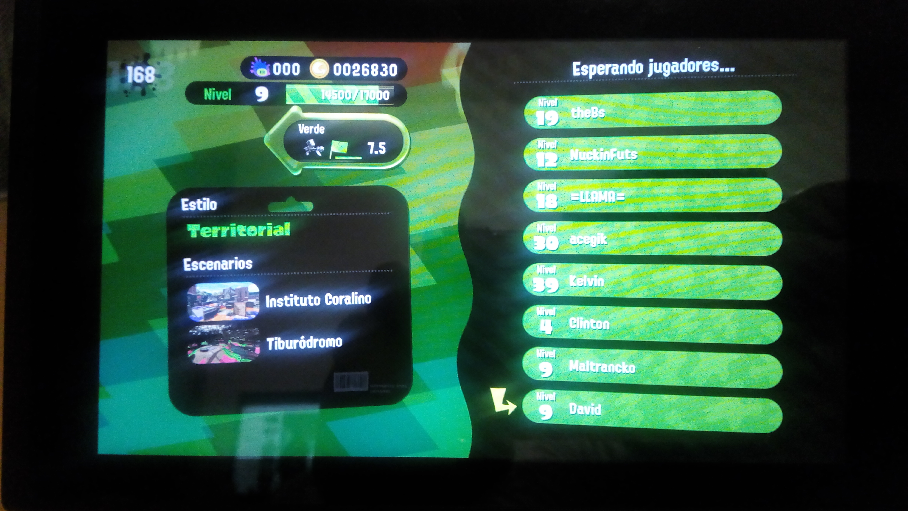

Y disfrute.
